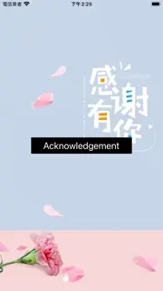

# WWAcknowledgementViewController

[](https://developer.apple.com/swift/) [](https://developer.apple.com/swift/)  [](https://developer.apple.com/swift/) [](https://developer.apple.com/swift/)

### [Introduction - 簡介](https://swiftpackageindex.com/William-Weng)
- [Quickly and easily create a acknowledge screen.](https://github.com/showdownjs/showdown)
- [快速、簡單的做一個致謝的畫面。](https://swiftpackageindex.com/William-Weng)



### [Installation with Swift Package Manager](https://medium.com/彼得潘的-swift-ios-app-開發問題解答集/使用-spm-安裝第三方套件-xcode-11-新功能-2c4ffcf85b4b)

```bash
dependencies: [
    .package(url: "https://github.com/William-Weng/WWAcknowledgementViewController.git", .upToNextMajor(from: "1.0.0"))
]
```

### [Function - 可用函式](https://ezgif.com/video-to-webp)
|函式|功能|
|-|-|
|displayContent(_:)|顯示內容|

### Example
```swift
import UIKit
import WWAcknowledgementViewController

final class ViewController: UIViewController {

    private let storyboardId = "AcknowledgementVC"
    
    private let markdown = """
    # Acknowledgement
    
    ## Contributors
    - [William-Weng](https://william-weng.github.io/)
    - [Swift Package Index](https://swiftpackageindex.com/William-Weng)
    
    ## These third-party libraries are used
    |Package|License|
    |---|---|
    |[Showdown](https://github.com/showdownjs/showdown)|MIT|
    |[WWJavaScriptContext](https://github.com/William-Weng/WWJavaScriptContext/)|MIT|
    |[WWJavaScriptContext+Markdown](https://github.com/William-Weng/WWJavaScriptContext_Markdown/)|MIT|
    """
    
    @IBAction func displayHTML(_ sender: UIButton) {
        
        let viewController = UIStoryboard(name: "Main", bundle: nil).instantiateViewController(identifier: storyboardId) as AcknowledgementViewController
        viewController.displayContent(.markdown(markdown))
        
        present(viewController, animated: true)
    }
}

final class AcknowledgementViewController: WWAcknowledgementViewController {}
```

